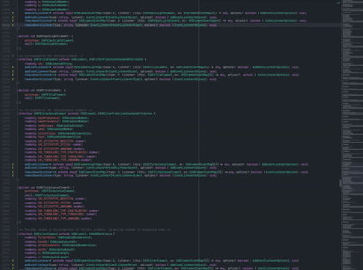

# MoveFast Jetbrains IDE Plugin
> A plugin that enables Jetbrain's IDEs to navigate multiple lines at once.

### Installation
>Available at Jetbrains IDE's plugins marketplace! just search for 'MoveFast' and download!
>*You may have to re-configure your keymaps. default shortcuts for MoveFast are Alt+Up,Down Arrows. and it can be changed in keymaps.
